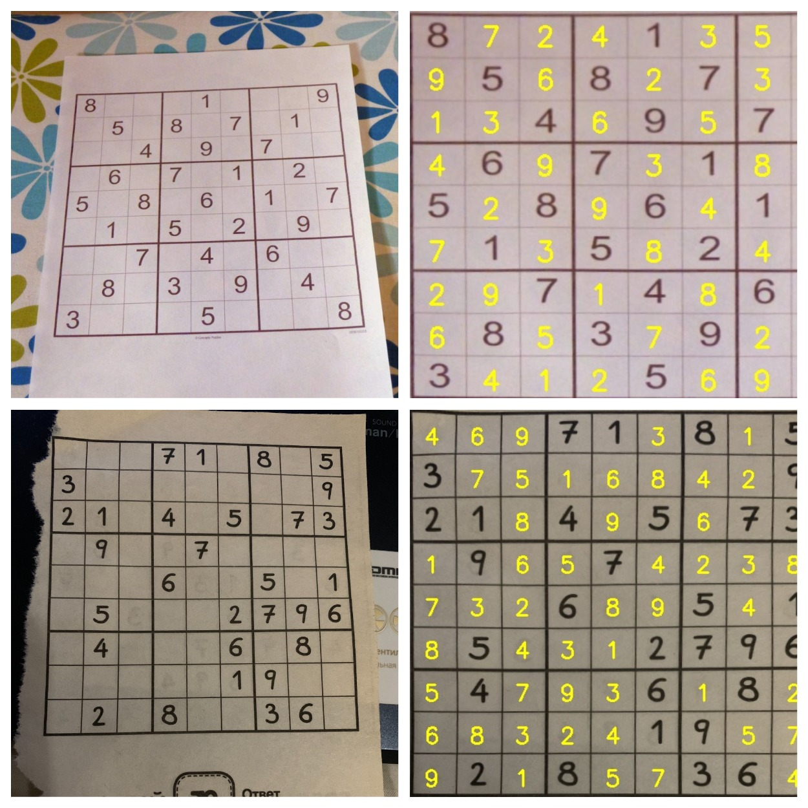

# Sudoku Solver

#### Structure:
- models - containts models for digit recognition
- src:
    - scripts to build and train digit recognition models
    - script to find puzzle on image and extract digit from given cell
    - script to solve sudoku and add solution digits on it
- tests - containts test and result images. Also contains collage to demonstrate it all together

#### Usage:
All required packages listed in "requirements.txt". 
Example usage is shown in "tests/test.py".

#### Results:

